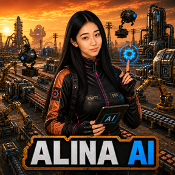
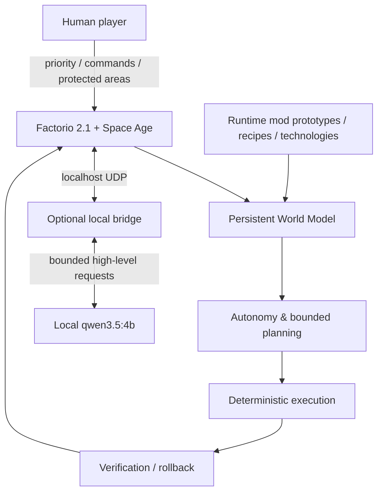

<div align="center">



# Alina AI Teammate for Factorio

### A second engineer inside your factory.

**Autonomous. Physical. Mod-aware. Built for real saves.**

[](https://www.factorio.com/)
[](#verified-release-gate)
[](https://github.com/KORTY-DEV/alina-ai-teammate/actions/workflows/ci.yml)
[](LICENSE)
[](https://web.tribute.tg/d/OAM)

[**Quick start**](#start-playing) · [**Capabilities**](#what-alina-can-do-today) · [**Architecture**](#architecture) · [**Verified tests**](#verified-release-gate) · [**Roadmap**](#what-comes-next) · [**Support**](#support-alina)

</div>

---

## What is Alina?

**Alina AI Teammate** is an autonomous teammate for **Factorio 2.1 + Space Age**.

She is not a chat overlay and not a scripted showcase. Alina exists as a **separate visible character inside the game**. She reads the real factory through the Factorio Lua API, builds a persistent World Model, chooses bounded useful tasks, gathers materials, expands production, verifies the result and yields when a human player is working in the same area.

The project is designed around a simple idea:

> **You should be able to open a real factory, bring Alina into it, and feel like another engineer joined the save.**

This repository contains the **first public playable MVP / early-access release — version `0.1.0`**. The foundation is already working; trains, planets, deeper late-game planning and larger-scale combat are future work.

<div align="center">

### `PLAYER INTENT > AI INTENT`

Alina is autonomous by default, but the player always has priority.

</div>

---

## Why Alina feels different

| | Capability | What it means in play |
|---|---|---|
| 🧍 | **Physical teammate** | She walks, mines, carries items, builds, equips gear and can use her own Spidertron. |
| 🏭 | **Existing-save first** | You can bring her into a developed factory instead of starting in a special sandbox. |
| 🧠 | **Persistent World Model** | She understands machines, recipes, storage, resources, technologies, production, power and known player activity. |
| 🧩 | **Mod-aware planning** | Runtime prototypes and recipes are used instead of assuming vanilla entity names. |
| 🔗 | **Working production chains** | She builds connected miners, smelting/assembly, belts, inserters, power, buffers and fluid systems — not decorative props. |
| ✅ | **Verification after construction** | A task is not successful merely because entities were placed; real state/output is checked afterwards. |
| ↩️ | **Transactional rollback** | Failed construction can be rolled back without tearing apart the player's existing factory. |
| 🤝 | **Player conflict policy** | Active player areas, protected zones and ownership rules override autonomous work. |
| 🌊 | **Fluid-aware construction** | Multi-fluid blocks use real fluidbox topology, isolated lines, tanks and powered pumps. |
| 🚆 | **Rail-crossing safety** | She can wait for trains and cross rails safely without pretending train-network control already exists. |
| 🎮 | **Multiplayer-safe design** | The release gate includes host + two clients, disconnect/rejoin and no desync report. |
| 🖥️ | **No screenshots required** | The factory is understood directly from game state rather than computer vision. |

On a copy of a real **K2SO** save, Alina independently selected work, built and verified a useful **four-machine production block**, and the save-copy integrity hash remained unchanged after the test.

**And this is version 0.1.0.**

---

# Start playing

There are two supported ways to use Alina.

## Full local mode — recommended

This is the complete repository workflow: Factorio + Alina mod + local bridge + optional local high-level model.

### Requirements on Windows

- Factorio 2.1;
- **.NET 8 SDK**;
- **Ollama**;
- several GB of free disk space for the local model.

Install the two dependencies once:

```powershell
winget install Microsoft.DotNet.SDK.8
winget install Ollama.Ollama
```

You do **not** need to manually search for or download the model. On the first full-mode launch, Alina checks Ollama and automatically downloads **`qwen3.5:4b`** if it is missing. Future launches reuse it.

### Continue an existing factory

Close Factorio and run:

```text
START_ALINA_PLAYABLE.cmd
```

The launcher creates a separate `Alina-Playable.zip`, keeps your original save untouched, enables Alina without changing the state of other mods, starts the local bridge and opens the safe copy directly.

To deliberately recreate the safe copy from your newest save later:

```text
RESET_ALINA_PLAYABLE_FROM_LATEST_SAVE.cmd
```

### Start a completely new game

Run:

```text
START_ALINA_NEW_GAME.cmd
```

Factorio opens at the normal main menu with Alina already enabled and the bridge running. Choose **New game**, configure the world normally and play from the beginning with Alina.

### Talk to her when you want — or let her work

Alina can operate autonomously. Direct commands can redirect priorities, protect areas, control research or give map targets.

Example:

```text
Аля, продолжай развивать базу
```

## Mod-only mode

If you do not want .NET or Ollama, install the packaged Factorio mod normally into the Factorio `mods` folder.

Core deterministic world modelling, autonomy and supported in-game commands live in the mod. The local bridge/model is an optional extension for bounded high-level requests.

> **Need more detail?** See [`docs/INSTALL_AND_RUN.md`](docs/INSTALL_AND_RUN.md).

---

## What Alina can do today

### Factory development

- physical mining, crafting and acquisition from existing storage/machines;
- planned construction inventory and equipment/fuel handling;
- drills, furnaces, assemblers, belts, inserters, poles, buffers and robot logistics;
- connected item-production blocks and long belt routes;
- multi-fluid production using real fluidbox topology, isolated lines, tanks and powered pumps;
- production/consumption analysis and bottleneck classification;
- power repair and capacity handling;
- runtime mod-aware recipe/prototype/technology selection;
- verified upgrades and rollback when a task makes things worse.

### Team behaviour

- autonomous bounded task selection;
- player-priority zones and permanent protected areas;
- research priority, pause and return-to-autonomy control;
- named/GPS map targets;
- Russian names and commands including `Алина`, `Аля`, `Алечка` and custom variants;
- safe movement on belts, construction robots, equipment, Spidertron and rail crossings.

For the detailed Russian capability document, see [`docs/ALINA_MVP_CAPABILITIES_RU.md`](docs/ALINA_MVP_CAPABILITIES_RU.md).

---

## Architecture



### Design principles

**Deterministic low-level gameplay.** Movement, sensing, construction, conflict handling and ordinary autonomy are implemented in bounded game-side logic.

**High-level model only where useful.** The optional local model is outside the per-tick gameplay loop and is not required for core deterministic operation.

**No screenshot pipeline.** Alina understands the factory through real Factorio state.

**Existing factories are protected.** Construction is transactional and player intent outranks autonomous intent.

---

## Verified release gate

The current `0.1.0` playable MVP passed:

- ✅ clean .NET build with no warnings;
- ✅ contract tests: **15/15**;
- ✅ full physical E2E;
- ✅ multiplayer host + 2 clients, disconnect/rejoin, no desync report;
- ✅ multi-fluid production E2E;
- ✅ rail-safety E2E;
- ✅ performance and megabase endurance checks;
- ✅ real K2SO save-copy test with an autonomously built and verified 4-machine production block;
- ✅ save-copy integrity verification;
- ✅ project quality gate.

Detailed evidence, measurements and current limits live in [`docs/CURRENT_STATUS.md`](docs/CURRENT_STATUS.md).

---

## What comes next

`0.1.0` is the beginning, not the finish line.

| Area | Current state | Direction |
|---|---|---|
| 🏭 Factory autonomy | **Playable** | deeper production planning and larger factories |
| 🧩 Mod awareness | **Playable** | broader late-game compatibility |
| 🚆 Trains | rail crossing only | train-network planning and control |
| 🪐 Planets | not in 0.1.0 | interplanetary logistics and progression |
| ⚔️ Combat | local/safe scope | larger defensive/offensive strategy |
| 🧪 Fluids | working bounded chains | deeper recursive modded-fluid dependencies |
| 🏗️ Megabases | tested at scale | broader optimization and architecture choices |

The goal is not to turn Alina into a macro recorder. The goal is to keep expanding the same teammate architecture until she can participate in much more of a real long-running Factorio playthrough.

---

## Support Alina

<div align="center">

### 💜 Help accelerate the next versions

Alina AI Teammate is an independent project. Support helps fund more development time, testing, compatibility work, release preparation and the next major gameplay systems.

[](https://web.tribute.tg/d/OAM)

**[Open the support page](https://web.tribute.tg/d/OAM)**

</div>

Support is optional. The project page, source and public development remain visible regardless of donation status.

---

## Repository map

```text
factorio-mod/   Factorio mod source
bridge/         optional localhost bridge
docs/           architecture, status, capabilities, release notes
scripts/        launchers, packaging and release-gate tools
tests/          deterministic test fixtures
.github/        CI, funding and contribution templates
```

Useful documents:

- [`docs/CURRENT_STATUS.md`](docs/CURRENT_STATUS.md) — verified current state and measurements;
- [`docs/ARCHITECTURE.md`](docs/ARCHITECTURE.md) — technical architecture;
- [`docs/ALINA_MVP_CAPABILITIES_RU.md`](docs/ALINA_MVP_CAPABILITIES_RU.md) — full Russian capability description;
- [`docs/INSTALL_AND_RUN.md`](docs/INSTALL_AND_RUN.md) — installation and troubleshooting;
- [`docs/MOD_PORTAL.md`](docs/MOD_PORTAL.md) — Mod Portal release text;
- [`SECURITY.md`](SECURITY.md) — security and save/privacy guidance;
- [`SUPPORT.md`](SUPPORT.md) — project support information.

---

## Development & validation

```powershell
scripts\Test-Project.ps1
scripts\Test-AlinaFluids.ps1
scripts\Test-AlinaRailSafety.ps1
scripts\Test-AlinaPerformance.ps1
scripts\Run-QualityGate.ps1
scripts\Package-Mod.ps1
```

Pull requests should preserve the invariants in [`docs/PRODUCT_REQUIREMENTS.md`](docs/PRODUCT_REQUIREMENTS.md). Bug reports and feature requests have dedicated GitHub issue forms.

---

## License

Copyright © 2026 **KORTYDEV**. All rights reserved.

The source is publicly available for inspection, security review and evaluation. Reuse, modification, redistribution, relicensing or derivative works require prior written permission. See [`LICENSE`](LICENSE).

---

<div align="center">

### Alina AI Teammate for Factorio

**Built by Korty / KORTYDEV**

`0.1.0 — first public playable MVP`

</div>
