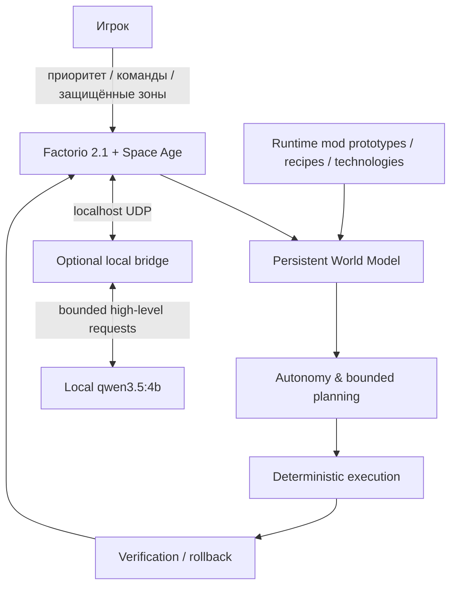

<div align="center">


# Alina AI Teammate for Factorio

### Второй инженер внутри вашей фабрики.

**Автономная. Физическая. Mod-aware. Создана для настоящих сохранений.**

[](https://www.factorio.com/)
[](#проверенный-release-gate)
[](https://github.com/KORTY-DEV/alina-ai-teammate/actions/workflows/ci.yml)
[](LICENSE)
[](https://web.tribute.tg/d/OAM)

[**English**](README.md) · **Русский**

[**Быстрый старт**](#начать-играть) · [**Возможности**](#что-алина-умеет-сейчас) · [**Архитектура**](#архитектура) · [**Проверки**](#проверенный-release-gate) · [**Планы**](#что-дальше) · [**Поддержать**](#поддержать-alina)

</div>

---

## Что такое Alina?

**Alina AI Teammate** — автономный тиммейт для **Factorio 2.1 + Space Age**.

Это не чат поверх игры и не заскриптованная демонстрация. Алина существует как **отдельный видимый персонаж внутри Factorio**. Она читает реальное состояние фабрики через Factorio Lua API, поддерживает постоянную World Model, сама выбирает ограниченные полезные задачи, добывает и собирает материалы, расширяет производство, проверяет результат и уступает игроку, если тот работает в той же зоне.

Идея проекта простая:

> **Вы должны иметь возможность открыть настоящую фабрику, добавить в сохранение Алину и почувствовать, что к игре присоединился второй инженер.**

Сейчас опубликована **первая playable MVP / early-access версия — `0.1.0`**. Основа уже работает; поезда, планеты, более глубокое late-game планирование и крупная боевая стратегия — следующие этапы развития.

<div align="center">

### `PLAYER INTENT > AI INTENT`

Алина автономна по умолчанию, но приоритет всегда остаётся за игроком.

</div>

---

## Почему Алина ощущается иначе

| | Возможность | Что это значит в игре |
|---|---|---|
| 🧍 | **Физический тиммейт** | Она ходит, добывает ресурсы, носит предметы, строит, надевает экипировку и может использовать собственного Spidertron. |
| 🏭 | **Работа с существующими сейвами** | Её можно добавить в уже развитую фабрику, а не только запускать в специальном тестовом мире. |
| 🧠 | **Постоянная World Model** | Она понимает машины, рецепты, хранилища, ресурсы, технологии, производство, питание и известную активность игрока. |
| 🧩 | **Mod-aware планирование** | Используются реальные runtime prototypes и recipes, а не жёстко прописанные vanilla-имена сущностей. |
| 🔗 | **Рабочие производственные цепочки** | Алина строит связанные буры, плавку/сборку, ленты, манипуляторы, питание, буферы и жидкости — не декоративные заготовки. |
| ✅ | **Проверка после строительства** | Задача не считается выполненной просто потому, что объекты поставлены: после стройки проверяется реальное состояние и выпуск. |
| ↩️ | **Транзакционный откат** | Неудачную собственную стройку можно откатить, не разбирая существующую фабрику игрока. |
| 🤝 | **Приоритет игрока** | Активные зоны игрока, защищённые области и правила владения имеют приоритет над автономной работой. |
| 🌊 | **Работа с жидкостями** | Многожидкостные блоки строятся по реальной fluidbox-топологии с изолированными линиями, ёмкостями и запитанными насосами. |
| 🚆 | **Безопасное пересечение рельсов** | Алина умеет ждать поезд и безопасно пересекать пути, не изображая полноценное управление железнодорожной сетью. |
| 🎮 | **Multiplayer-safe архитектура** | Release gate включает host + 2 клиента, выход/повторное подключение и отсутствие desync report. |
| 🖥️ | **Без скриншотов** | Фабрика понимается напрямую через игровое состояние, а не через computer vision. |

На копии настоящего **K2SO**-сейва Алина самостоятельно выбрала работу, построила и проверила полезный **производственный блок из четырёх машин**, при этом контроль целостности копии сохранения остался успешным.

**И это версия 0.1.0.**

---

# Начать играть

Есть два поддерживаемых способа использования Алины.

## Полный локальный режим — рекомендуется

Это полный сценарий репозитория: Factorio + мод Алины + локальный bridge + необязательная локальная модель для ограниченных высокоуровневых запросов.

### Требования для Windows

- Factorio 2.1;
- **.NET 8 SDK**;
- **Ollama**;
- несколько гигабайт свободного места для локальной модели.

Один раз установите зависимости:

```powershell
winget install Microsoft.DotNet.SDK.8
winget install Ollama.Ollama
```

Модель **не нужно искать и скачивать вручную**. При первом запуске полного режима launcher проверит Ollama и автоматически загрузит **`qwen3.5:4b`**, если её ещё нет. Следующие запуски используют уже установленную модель.

### Продолжить существующую фабрику

Закройте Factorio и запустите:

```text
START_ALINA_PLAYABLE.cmd
```

Launcher создаст отдельный `Alina-Playable.zip`, оставит исходный сейв нетронутым, включит Алину без изменения состояния остальных модов, запустит локальный bridge и откроет безопасную копию напрямую.

Чтобы позже намеренно пересоздать безопасную копию из самого свежего сейва:

```text
RESET_ALINA_PLAYABLE_FROM_LATEST_SAVE.cmd
```

### Начать совершенно новую игру

Запустите:

```text
START_ALINA_NEW_GAME.cmd
```

Factorio откроется в обычном главном меню, но Алина уже будет включена, а bridge — запущен. Выберите **Новая игра**, настройте мир как обычно и начинайте прохождение вместе с Алиной с самого начала.

### Общаться, когда нужно — или просто дать ей работать

Алина может работать автономно. Прямыми командами можно менять приоритеты, защищать зоны, управлять исследованиями или задавать цели на карте.

Пример:

```text
Аля, продолжай развивать базу
```

## Только мод

Если вы не хотите устанавливать .NET или Ollama, установите упакованный Factorio-мод обычным способом в папку `mods`.

Основная детерминированная World Model, автономия и поддерживаемые игровые команды находятся внутри мода. Локальный bridge/model — необязательное расширение для ограниченных high-level запросов.

> **Нужно подробнее?** См. [`docs/INSTALL_AND_RUN.md`](docs/INSTALL_AND_RUN.md).

---

## Что Алина умеет сейчас

### Развитие фабрики

- физическая добыча, крафт и получение материалов из существующих хранилищ/машин;
- планируемый строительный запас, экипировка и топливо;
- буры, печи, сборщики, ленты, манипуляторы, столбы, буферы и robot logistics;
- связанные item-production блоки и длинные ленточные маршруты;
- многожидкостное производство по реальной fluidbox-топологии, изолированные линии, ёмкости и запитанные насосы;
- анализ производства/потребления и классификация bottleneck;
- восстановление питания и работа с доступной мощностью;
- runtime mod-aware выбор recipes/prototypes/technologies;
- проверяемые upgrades и rollback, если задача ухудшила состояние фабрики.

### Поведение тиммейта

- автономный выбор ограниченных задач;
- player-priority zones и постоянные защищённые области;
- приоритет исследований, пауза и возврат к автономии;
- named/GPS цели на карте;
- русские имена и обращения: `Алина`, `Аля`, `Алечка` и пользовательские варианты;
- безопасное движение по лентам, строительные роботы, экипировка, Spidertron и пересечение рельсов.

Полное русское описание возможностей: [`docs/ALINA_MVP_CAPABILITIES_RU.md`](docs/ALINA_MVP_CAPABILITIES_RU.md).

---

## Архитектура



### Принципы

**Детерминированный low-level gameplay.** Движение, сенсоры, строительство, разрешение конфликтов и обычная автономия реализованы ограниченной игровой логикой.

**High-level модель только там, где она полезна.** Необязательная локальная модель находится вне per-tick игрового цикла и не требуется для основной детерминированной работы.

**Без screenshot pipeline.** Алина понимает фабрику через реальное состояние Factorio.

**Существующая фабрика защищена.** Строительство транзакционное, а намерение игрока важнее автономного намерения.

---

## Проверенный release gate

Текущий playable MVP `0.1.0` прошёл:

- ✅ чистую .NET-сборку без предупреждений;
- ✅ контрактные тесты: **15/15**;
- ✅ полный физический E2E;
- ✅ multiplayer host + 2 клиента, disconnect/rejoin, без desync report;
- ✅ multi-fluid production E2E;
- ✅ rail-safety E2E;
- ✅ performance и megabase endurance проверки;
- ✅ тест на копии реального K2SO-сейва с автономно построенным и проверенным блоком из 4 машин;
- ✅ проверку целостности копии сохранения;
- ✅ project quality gate.

Подробные доказательства, измерения и текущие ограничения: [`docs/CURRENT_STATUS.md`](docs/CURRENT_STATUS.md).

---

## Что дальше

`0.1.0` — это начало, а не финал.

| Область | Сейчас | Направление |
|---|---|---|
| 🏭 Автономия фабрики | **Playable** | более глубокое производственное планирование и более крупные фабрики |
| 🧩 Mod awareness | **Playable** | более широкая late-game совместимость |
| 🚆 Поезда | только безопасное пересечение | планирование и управление железнодорожной сетью |
| 🪐 Планеты | отсутствуют в 0.1.0 | межпланетная логистика и прогрессия |
| ⚔️ Бой | локальный/безопасный scope | более крупная оборонительная и наступательная стратегия |
| 🧪 Жидкости | рабочие ограниченные цепочки | более глубокие рекурсивные modded-fluid зависимости |
| 🏗️ Мегабазы | протестировано на масштабе | более широкая оптимизация и выбор архитектуры |

Цель проекта — не превратить Алину в macro recorder. Цель — развивать ту же архитектуру настоящего тиммейта, пока она не сможет участвовать в значительно большей части длительного прохождения Factorio.

---

## Поддержать Alina

<div align="center">

### 💜 Помогите ускорить следующие версии

Alina AI Teammate — независимый проект. Поддержка помогает выделять больше времени на разработку, тестирование, совместимость, подготовку релизов и следующие крупные игровые системы.

[](https://web.tribute.tg/d/OAM)

**[Открыть страницу поддержки](https://web.tribute.tg/d/OAM)**

</div>

Поддержка полностью добровольна. Страница проекта, исходники и публичная разработка остаются доступными независимо от донатов.

---

## Структура репозитория

```text
factorio-mod/   исходный код Factorio-мода
bridge/         необязательный localhost bridge
docs/           архитектура, статус, возможности, release notes
scripts/        launchers, упаковка и release-gate инструменты
tests/          детерминированные test fixtures
.github/        CI, funding и шаблоны участия
```

Полезные документы:

- [`docs/CURRENT_STATUS.md`](docs/CURRENT_STATUS.md) — проверенное текущее состояние и измерения;
- [`docs/ARCHITECTURE.md`](docs/ARCHITECTURE.md) — техническая архитектура;
- [`docs/ALINA_MVP_CAPABILITIES_RU.md`](docs/ALINA_MVP_CAPABILITIES_RU.md) — полное русское описание возможностей;
- [`docs/INSTALL_AND_RUN.md`](docs/INSTALL_AND_RUN.md) — установка и устранение проблем;
- [`docs/MOD_PORTAL.md`](docs/MOD_PORTAL.md) — текст для Mod Portal;
- [`SECURITY.md`](SECURITY.md) — безопасность, сейвы и приватность;
- [`SUPPORT.md`](SUPPORT.md) — информация о поддержке проекта.

---

## Разработка и проверка

```powershell
scripts\Test-Project.ps1
scripts\Test-AlinaFluids.ps1
scripts\Test-AlinaRailSafety.ps1
scripts\Test-AlinaPerformance.ps1
scripts\Run-QualityGate.ps1
scripts\Package-Mod.ps1
```

Pull request должны сохранять инварианты из [`docs/PRODUCT_REQUIREMENTS.md`](docs/PRODUCT_REQUIREMENTS.md). Для bug report и feature request настроены отдельные GitHub issue forms.

---

## Лицензия

Copyright © 2026 **KORTYDEV**. Все права защищены.

Исходный код публично доступен для просмотра, security review и оценки. Повторное использование, изменение, перераспространение, relicensing и создание производных работ требуют предварительного письменного разрешения. См. [`LICENSE`](LICENSE).

---

<div align="center">

### Alina AI Teammate for Factorio

**Автор: Korty / KORTYDEV**

`0.1.0 — первый публичный playable MVP`

</div>
